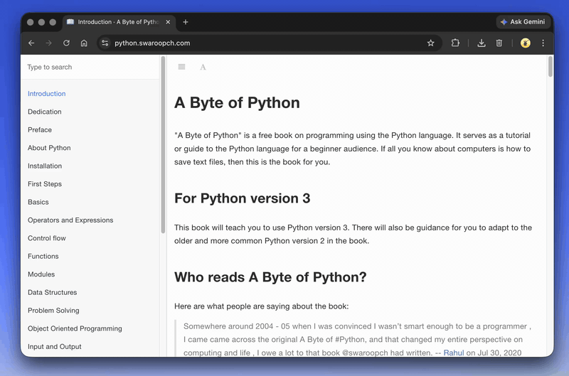

# RapidRead

A minimal macOS speed reader that uses RSVP (Rapid Serial Visual Presentation). Select text anywhere, press a hotkey, and read it word-by-word in a floating frosted-glass overlay.



## Requirements

- macOS 13+
- Swift 5.9+

## Install & Run

```bash
git clone https://github.com/chrisurline/rapid-read.git
cd rapid-read
swift run
```

The app runs as a menu bar utility (no dock icon). Look for the `⊞` icon in your menu bar.

## Setup

1. **Disable Spotlight's ⌘Space shortcut**
   System Settings → Keyboard → Keyboard Shortcuts → Spotlight → uncheck "Show Spotlight search"

2. **Grant Accessibility permissions**
   The app will prompt on first launch. Required to capture the hotkey and copy selected text.

## Usage

1. Select text in any app (browser, editor, PDF viewer, etc.)
2. Press **⌘Space** — a reader appears at your cursor
3. Press **⌘Space** again or **Esc** to dismiss
4. Clicking outside the reader also dismisses it

### Controls

| Key | Action |
|---|---|
| `Space` | Pause / resume (restart if finished) |
| `←` / `→` | Skip back / forward 5 words |
| `⌥←` / `⌥→` | Skip back / forward 10 words |
| `↑` / `↓` | Speed ±25 WPM |
| `Esc` | Dismiss |
| Click | Pause / resume |
| Drag | Move the reader window |

## Configuration

Settings are stored at `~/.config/rapidread/settings.json` (created on first launch). Open it from the menu bar icon → "Open Settings…"

```json
{
  "corner_radius" : 16,
  "font_size" : 42,
  "skip_large" : 10,
  "skip_small" : 5,
  "start_delay" : 0.5,
  "window_height" : 160,
  "window_width" : 600,
  "wpm" : 425,
  "wpm_step" : 25
}
```

| Setting | Description |
|---|---|
| `wpm` | Starting words per minute |
| `wpm_step` | How much ↑/↓ adjusts speed |
| `font_size` | Word display size in points |
| `start_delay` | Seconds before playback begins (first word shows immediately) |
| `window_width` / `window_height` | Reader panel dimensions |
| `corner_radius` | Panel corner rounding |
| `skip_small` / `skip_large` | Words skipped by arrow / ⌥+arrow |

Changes take effect on next launch.
